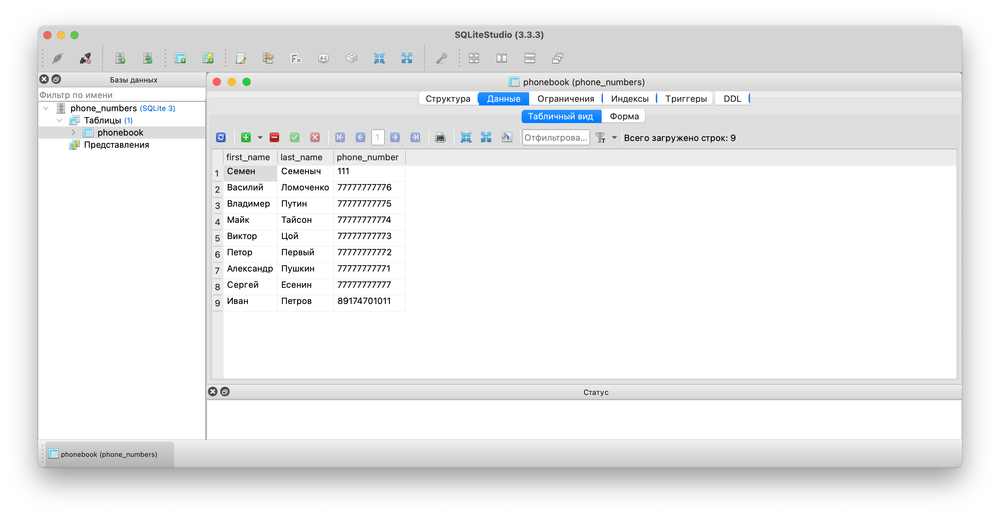

# Phonebook
**Задание:** Создать телефонный справочник с возможностью импорта и экспорта данных в нескольких форматах.

**Ввод:** Ввод данных осуществляться через консоль.

**Функции** Добавление, Удаление, Редактирование, экспорт в [Json](contacts.json) и [CSV](contacts.csv) формат.
 Функция записи [f_write.py](f_write.py)

**Хранение** Данные хранятся в [файле](phone_numbers.db). 
Использовалась sqlite3. [Модуль по управлению БД](db.py)

